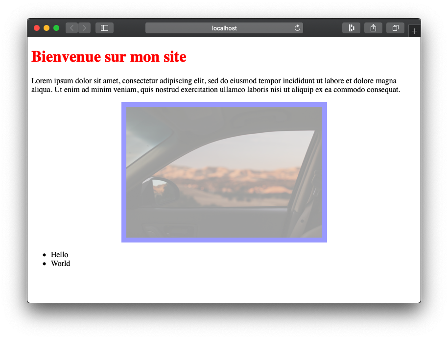
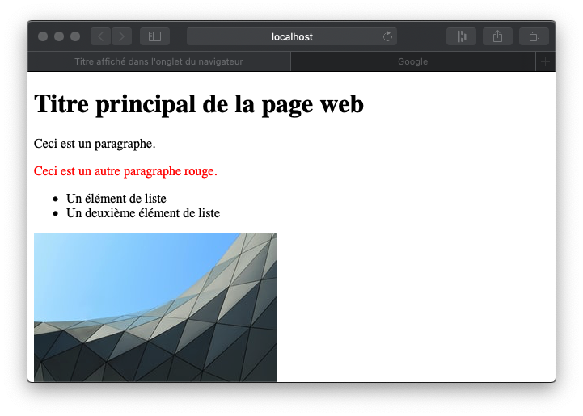

##### ECE Lyon - ING2 - Informatique 4 - 2019-2020
# :100: TP noté d'informatique

---

## Plan

Parcourez bien cette page avant de commencer.

- [Retour étudiant (à remplir)](#retour-étudiant)
- [Règles](#warning-règles)
- [Conseils](#conseils)
- [Cahier des charges](#cahier-des-charges)
- [Exemple](#exemple)
- [Critères d'évaluation](#critères-dévaluation)
- [Aide](#aide)
    - [Le langage HTML](#le-langage-html)
    - [Code de base pour générer un fichier HTML](#code-c-pour-générer-un-fichier-html-adaptation-de-svgfile)
    - [Checklist](#checklist)

---

## Retour étudiant

Renseignez ici ce que vous avez intégré dans votre projet en respectant le format suivant :

- [x] Tâche terminée et fonctionnelle _(cochée)_
- [ ] Tentative non terminée ou non fonctionnelle _(non cochée)_

### Tâches fonctionnelles - tentatives

- [x] Lire l'énoncé
- [ ] ...

### Rédaction libre de l'étudiant :

_Vous __pouvez__ rédiger ici afin de décrire vos tentatives, problèmes..._

---

## :warning: Règles

- Vous êtes responsable de l'envoi de votre code à GitHub, vérifiez que les modifications apparaissent sur le site GitHub.com après chaque __push__.
- ✅ Vous avez le droit d'utiliser vos TP, ainsi que les ressources en ligne _(__documentation C++__, Google, StackOverflow, OpenClassrooms...)_.
- ❌ Vous n'avez pas le droit de travailler à plusieurs ou d'échanger durant le TP (~~Messenger~~, ~~Discord~~, ~~Slack~~, etc.). Vos devoirs seront analysés pas un système anti-plagiat intelligent (_Stanford University_).
- ⏳ Tous _Commit & Push_ effectués après l'heure de fin de l'épreuve ne seront pas pris en compte dans la notation. Un retard de 5 minutes est toléré _(nettoyage...)_.
- Vous devez modifier ce fichier `README.md` afin d'y renseigner ce que vous avez fait (ce qui est fonctionnel) -> rubrique [Retour étudiant](#retour-étudiant).

---

## Conseils

- Ne négligez pas la conception, la notation portera essentiellement sur la qualité de votre conception de de votre code. __Ne codez pas comme vous le feriez en C__, le C++ est un langage Orienté Objet.
- Vous trouverez à la fin de cette page des explications sur le langage HTML. Bien que sa compréhension ne soit pas obligatoire.
- __Rendez un projet qui compile__ : testez et corrigez les erreurs au fur et à mesure de votre avancée.

---

## Cahier des charges

Nous souhaitons réaliser une bibliothèque permettant de __générer des pages web__ (langage __HTML__).
Le langage HTML fonctionne de la même façon que le langage SVG déjà vu en TP. Vous trouverez des [explications sur sa syntaxe](#le-langage-html), ainsi qu'un [code de base pour générer un fichier HTML](#code-c-pour-générer-un-fichier-html-adaptation-de-svgfile), tout en bas de cette page.

Notre bibliothèque devra nous permettre, en appelant des méthodes, de construire une page HTML (en insérant les balises correspondantes).

Voici les principales spécificités du Cahier des Charges (vous pouvez les cocher au fur et à mesure dans le fichier `README.md`) :

- [ ] La bibliothèque doit être conçue de façon à pouvoir __rajouter de nouvelles balises facilement__ (en limitant la duplication de code).
- [ ] On veut pouvoir __éditer plusieurs pages web__ en même temps (`index.html` et `about.html` par exemple).
- [ ] Chaque page web possède un __nom__ (`index.html`) et __plusieurs balises__. 
    - [ ] On doit pouvoir y ajouter de nouvelles balises (toujours à la fin) facilement.
    - [ ] On doit pouvoir générer la page HTML correspondante quand on le souhaite.
- [ ] Chaque balise doit avoir :
    - [ ] Un __tag__, il s'agit du nom de la balise : `p` pour un paragraphe (`<p></p>`), `img` pour une image (``)
    - [ ] Une __liste d'attributs__ `attr="val"`. Attention, certaines balises __doivent__ posséder certains attributs. Exemples :
        - `<p title="Description">Un paragraphe.</p>` -> 1 attribut (facultatif) :
            - `title="Description"`
        - `` -> 2 attributs (obligatoires pour ``) :
            - `src="image.png"`
            - `alt="Une image"`
        - Dans ce TP, seule `` a des attributs obligatoires (`src` et `alt`).
    - [ ] Une __liste de styles__, qui sont insérés dans l'attribut `style=""` (que l'on pourra gérer séparément des autres attributs), séparés par un point-virgule.
        - `<p style="color:red;background-color:blue;font-family:Arial;">Un paragraphe.</p>` -> 3 styles :
            - `color: red;`
            - `background-color: blue;`
            - `font-family: Arial;`
        - `` -> 2 styles :
            - `border: solid 1px red;` (`solid` = type de trait (pas de pointillés), `1px` = épaisseur, `red` = couleur)
            - `opacity: 0.5;`
    - [ ] Une fonction de __génération de la balise HTML__ correspondante.
- [ ] Nous considérerons __3 types de balises__ :
    - Les balises __avec contenu textuel__ :<br>
    `<p>Du texte</p>`, `<li>Du texte</li>`, `<h1>Du texte</h1>`, `<h2>Du texte</h2>`
    - Les balises __avec sous-balises__ :<br>
    `<ul><li></li><li></li></ul>` : cette liste `<ul>` possède deux éléments de liste `<li>`.
    - Les balises __sans contenu__ :<br>
    `` _(attention à ne pas oublier ses attribut obligatoire : `src` et `alt`)_
    
Il n'est pas demandé de faire un menu, vous pouvez tester directement vos méthodes dans le main en codant des valeurs en dur (voir [exemple](#exemple) ci-dessous). 

Vous pouvez vous aider de la [checklist](#checklist) tout en bas de cette page.

#### Bonus

- [ ] Créer un __menu principal__ demandant à l'utilisateur ce qu'il veut ajouter, ainsi que le contenu de la balise à ajouter (au clavier).
- [ ] Ajouter un attribut ou un style à la dernière balises ajoutée à un page web.
- [ ] Liste ordonnée (`<ol>`), fonctionnant de la même façon que `<ul>`.
- [ ] _Autres au choix_

:four_leaf_clover: Bonne chance !

## Exemple

Voici un exemple d'utilisation souhaitée de la bibliothèque :

```C++
int main() {
    PageWeb pageWeb("index.html"); // Création d'une page web "index.html"

    pageWeb.add(new Titre(1, "Bienvenue sur mon site", { // Ajout du titre principal (<h1></h1>), avec comme couleur de texte le rouge
        {"color", "red"} // ira dans l'attribut HTML style=""
    }));
    
    pageWeb.add(new Paragraphe( // Ajout d'un paragraphe classique
        "Lorem ipsum dolor sit amet, consectetur adipiscing elit, sed do eiusmod tempor "
        "incididunt ut labore et dolore magna aliqua. Ut enim ad minim veniam, quis nostrud "
        "exercitation ullamco laboris nisi ut aliquip ex ea commodo consequat."
    ));
    
    pageWeb.add(new Image( // Ajout d'une image 
        "https://images.unsplash.com/photo-1591754889489-5a59f1cea55a?w=400", // adresse de l'image sur internet (attribut src="")
        "Désert vu depuis une voiture", // texte alternatif pour les personnes non voyantes (attribut alt="")
        { // Style de l'image :
            {"border", "solid 10px blue"}, // bordure bleue de 10px d'épaisseur
            {"opacity", "0.4"} // opacité de 0.4 (transparence)
        }
    ));
    
    pageWeb.add(new Liste({ // Ajout d'une liste
        new ListeElement("Hello"), // élément de liste
        new ListeElement("World") // élément de liste
    }));
    
    pageWeb.generate(); // Génération de la page HTML
    return 0;
}
```

_Fichier HTML généré :_

```html
<!doctype html>
<html lang="fr">
<head>
	<meta charset="utf-8">
	<title>index.html</title>
	<style>
		img {
			width: 90%;
			max-width: 400px;
			display: block;
			margin: 0 auto;
		}
	</style>
</head>
<body>
<h1 style="color:red;">Bienvenue sur mon site</h1>
<p>Lorem ipsum dolor sit amet, consectetur adipiscing elit, sed do eiusmod tempor incididunt ut labore et dolore magna aliqua. Ut enim ad minim veniam, quis nostrud exercitation ullamco laboris nisi ut aliquip ex ea commodo consequat.</p>

<ul>
	<li>Hello</li>
	<li>World</li>
</ul>
</body>
</html>
```

_Page web affichée dans un navigateur :_

<p align="center">
    
</p>

---

## Critères d'évaluation

- Utilisation de Git (pas de fichiers inutiles, commits réguliers et bien nommés...)
- POO : Conception UML
- C++/POO : 
  - Concepts implémentés (identifiez les plus pertinents lors de votre conception)
    - Encapsulation
    - Héritage
    - Polymorphisme
    - Classes abstraites
    - Méthodes virtuelles (pures)
    - Surcharge d'opérateurs, de fonctions
    - STL et choix des structures de données
    - Sérialisation
    - ...
  - Libération de la mémoire
  - Qualité du code (indentation, nommage des variables/fonctions, pas de code inutile, commentaires utiles, organisation des fichiers...)

---

## Aide

### Le langage HTML

Contrairement au C/C++ qui sont des langages algorithmiques, le HTML est un langage descritif : il n'y a ni test, ni boucle. Juste une descrition organisée du contenu d'une page web (textes, images... mais pas du design !), sous la forme de `<balises>` imbriquées (comme le SVG).

Les balises servent à donner une notion de __hiérarchie__ _(élément de liste dans une liste...)_ et/ou de __sémantique__ _(contenu très important...)_ à son contenu.
Il existe __deux types de balises__ :

- Les balises pouvant contenir du texte et/ou des balises (notion de hiérarchie) : `<p>contenu</p>` (une balise ouvrante et une balise fermante encadrent le contenu)
- Les balises ne contenant aucun contenu, ni texte, ni balise : `` (une seule balise, à la fois ouvrante et fermante (car pas de contenu)). Attention, le slah final n'est plus obligatoire en HTML5 (ex : `<br>` ou lieu de `<br />` (retour à la ligne))

Toute balise peut avoir des __attributs__ (paramètres), __dans la balise ouvrante ou l'unique balise uniquement__, sous la syntaxe `attr="val"` :

- `<p title="Une description">Un paragraphe.</p>` <br>(l'attribut `title` décrit quel texte afficher dans une infobulle lorsque la souris est arrêtée sur le contenu)
- `<p style="color:red;background-color:blue;">Un paragraphe rouge sur fond bleu.</p>` <br>(l'attribut `style` permet de styliser une balise, il peut être ajouté à toutes les balises)
- `` <br>(les attributs `src` et `alt` sont spécifiques à la balise `img` (image), ils permettent respectivement d'indiquer de quelle image il s'agit et à donner un un texte alternatif à lire oralement aux personnes non-voyantes)

#### Exemples de balises utiles à ce TP

- `<h1></h1>` indique au navigateur (Chrome, Firefox, Safari...) ou au moteur de recherche visitant notre page web que le contenu qui s'y trouve correspond au titre principal de la page web. Les navigateurs lui donneront ainsi l'apparence d'un titre, et les moteurs de recherches considèreront son contenu comme très important pour le référencement.
- `<h2></h2>`, `<h3></h3>`, ..., `<h6></h6>` représentent les sous-titres du plus haut hiérarchiquement au plus bas.
- `<ul></ul>` représente une liste non ordonnée (_Unordered List_). Contient des balises `<li></li>` uniquement.
- `<li></li>` représente un élément de liste (_Liste Item_). Ne peut être placée que dans une balise `<ul>` ou `<ol>` _(Ordrered List)_.
- `<p></p>` représente un paragraphe.
- `` représente une image (doit posséder les attributs `src` et `alt`).

#### Structure d'une page HTML

Tout document (fichier) HTML a une structure de base, dans laquelle on insère notre contenu dans la balise `<body></body>` :

```html
<!DOCTYPE html>
<html lang="fr">
    <head>
        <meta charset="utf-8" />
        <title>Title affiché dans l'onglet du navigateur</title>
    </head>
    <body>

    <!-- CONTENU ICI (ceci est un commentaire) -->

    </body>
</html>
```

_NB : L'indentation est facultative en HTML mais aide à la lecture (pour savoir quelle balise est dans laquelle)._

#### Exemple de page HTML complète

```html
<!doctype html>
<html lang="fr">
    <head>
        <meta charset="utf-8" />
        <title>Titre affiché dans l'onglet du navigateur</title>
    </head>
    <body>
        <h1>Titre principal de la page web</h1>
        <p>Ceci est un paragraphe.</p>
        <p style="color:red;">Ceci est un autre paragraphe rouge.</p>
        <ul>
            <li>Un élément de liste</li>
            <li>Un deuxième élément de liste</li>
        </ul>
        
    </body>
</html>
```

_Résultat :_

<p align="center">
    
</p>


### Code C++ pour générer un fichier HTML (adaptation de `SvgFile`)

Avec en commentaires le code pour garantir de ne pas ouvrir et éditer un fichier à plusieurs endroits en même temps.

```C++
#define ROOT "../"

std::ofstream file;

// if (s_openfiles.count(ROOT + filename)) {
//     throw std::runtime_error("Fichier " + filename + " déjà en cours d'édition.");
// }

std::cout << "Création du fichier HTML : " << filename << std::endl;
file.open(ROOT + filename);
// s_openfiles.insert(ROOT + filename);

if (!file) {
    std::cout << "Problème à l'ouverture du fichier " << filename << "." << std::endl;
    throw std::runtime_error("Ouverture du fichier " + filename + " impossible.");
}

// Ajout de l'en-tête d'une page HTML au fichier HTML en cours d'édition :
file << "<!doctype html>" << std::endl
     << "<html lang=\"fr\">" << std::endl
     << "<head>" << std::endl
     << "\t<meta charset=\"utf-8\">" << std::endl
     << "\t<title>" + m_filename + "</title>" << std::endl
     << "\t<style>" << std::endl // style (langage CSS) pour bien afficher les images.
     << "\t\timg {" << std::endl
     << "\t\t\twidth: 90%;" << std::endl
     << "\t\t\tmax-width: 400px;" << std::endl
     << "\t\t\tdisplay: block;" << std::endl
     << "\t\t\tmargin: 0 auto;" << std::endl
     << "\t\t}" << std::endl
     << "\t</style>" << std::endl
     << "</head>" << std::endl
     << "<body>" << std::endl;

/**
 *   AJOUTER LES BALISES HTML ICI
 */

// Ajout du pied de page (la fin) d'une page HTML au fichier HTML en cours d'édition :
file << "</body>" << std::endl
     << "</html>" << std::endl;

// Nous avons terminé d'éditer le fichier HTML, nous l'enlevons de la liste des fichiers en cours d'édition :
// s_openfiles.erase(ROOT + filename);
file.close();
```

### Checklist

- [ ] Création de plusieurs pages web
    - [ ] Génération du fichier HTML 
    - [ ] Ajout de nouvelles balises (à la fin)
- [ ] Libération de la mémoire
- [ ] Possibilité d'ajouter des styles à toutes les balises
- Dans un premier temps, nous souhaitons pouvoir ajouter les balises suivantes :
    - [ ] __Paragraphe__ : `<p>Ceci est un paragraphe.</p>`
        - [ ] Possibilité d'ajouter du style :  `<p style="color:red;background-color:blue;">Ceci est un paragraphe.</p>`
        - [ ] Possibilité d'ajouter des attributs :  `<p title="Test">Ceci est un paragraphe.</p>`
    - [ ] __Image__ : ``
        - [ ] Les attributs `src` et `alt` sont obligatoires à la création de la balise.
        - [ ] Possibilité d'ajouter du style :  ``
        - [ ] Possibilité d'ajouter des attributs :  ``
    - [ ] __Titre__ : `<h1>Titre principal</h1>`, `<h2>Titre secondaire</h2>`
        - [ ] __Possibilité de choisir le niveau du titre__ (de 1 (`<h1></h1>`) à 6 (`<h6></h6>`))
        - [ ] Possibilité d'ajouter du style :  `<h1 style="color:red;background-color:blue;">Titre</h1>`
        - [ ] Possibilité d'ajouter des attributs :  `<h1 title="Test">Titre</h1>`
    - [ ] __Liste  non ordonnée__ : `<ul></ul>`
        - [ ] Possibilité d'ajouter du style :  `<ul style="color:red;background-color:blue;"></ul>`
        - [ ] Possibilité d'ajouter des attributs :  `<ul title="Test"></ul>`
        - [ ] Possibilité d'ajouter des __Élément de liste__ : `<li>Élément de liste</li>`
            - [ ] Possibilité d'ajouter du style :  `<li style="color:red;background-color:blue;">Élément de liste</li>`
            - [ ] Possibilité d'ajouter des attributs :  `<li title="Test">Élément de liste</li>`
- [ ] Chaque balise génère son code HTML correspondant.